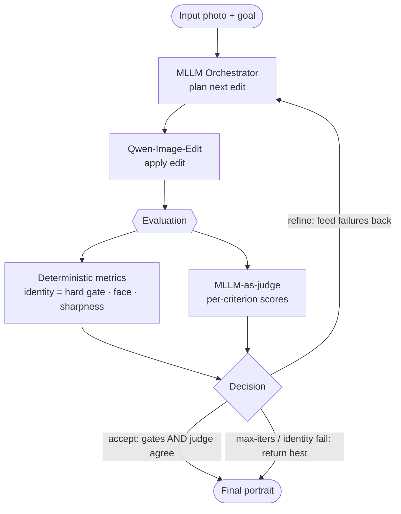
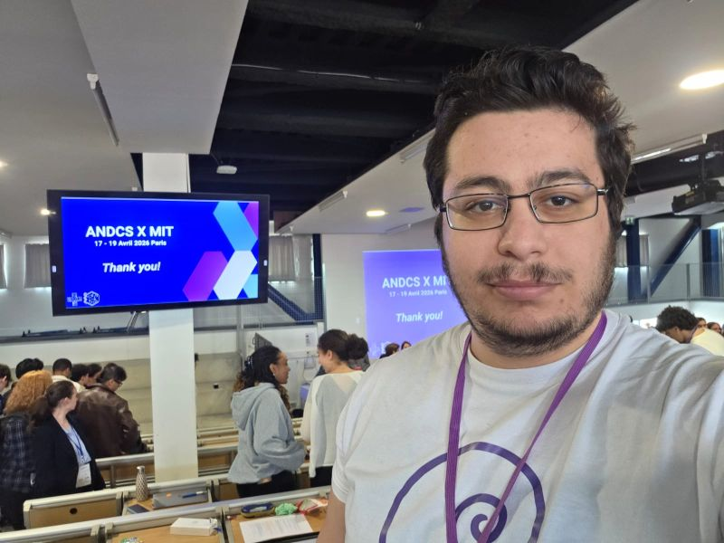
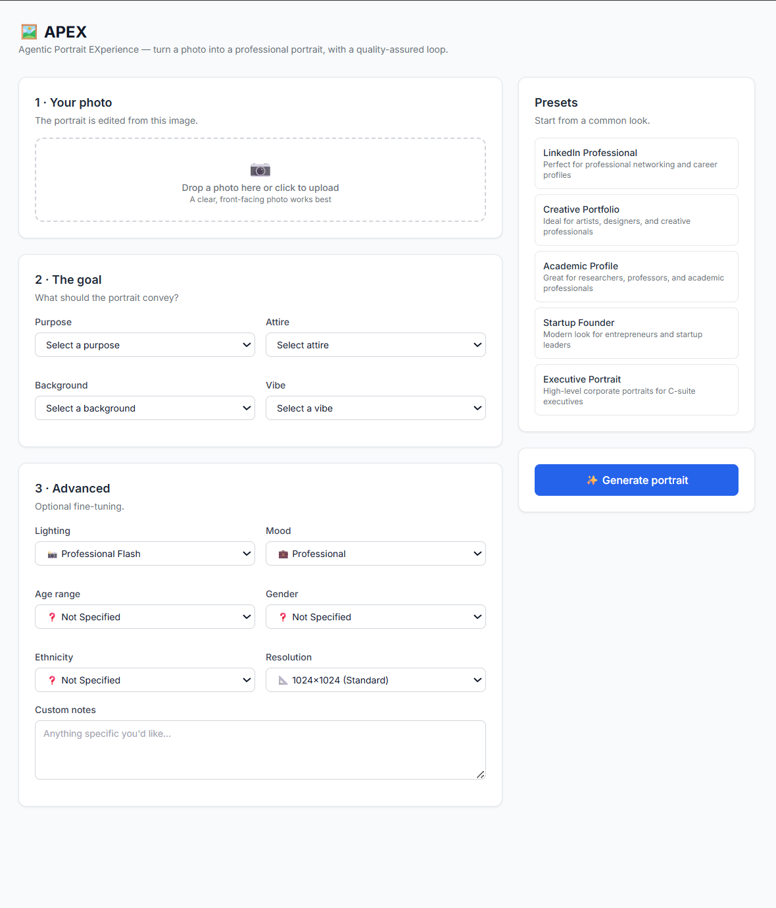
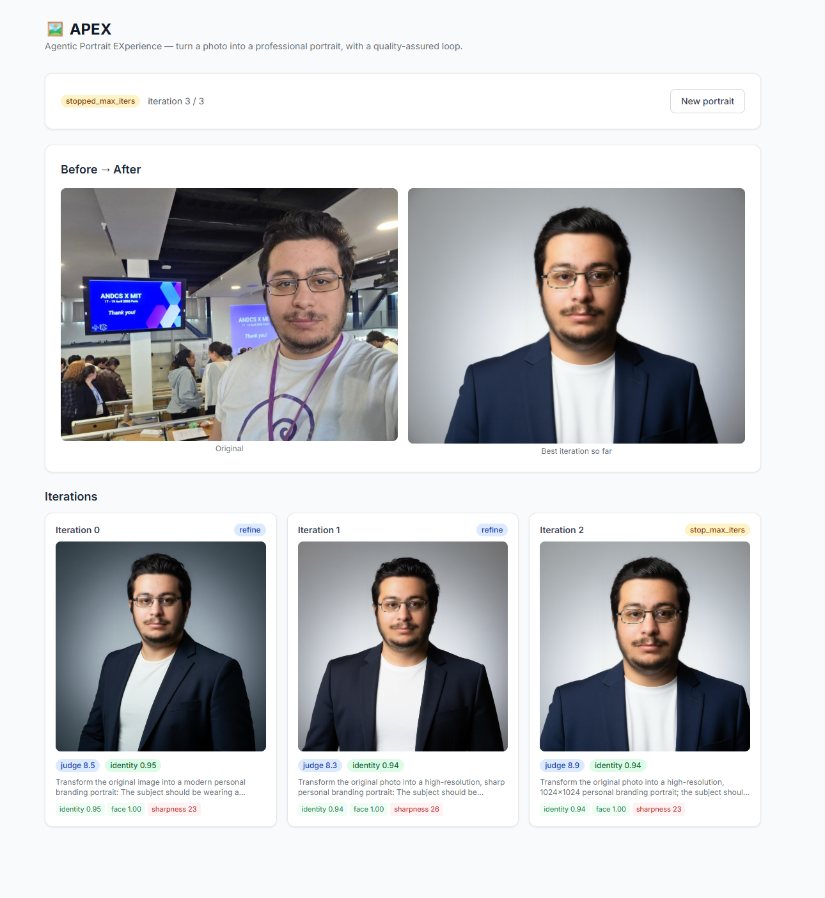

# APEX — Agentic Portrait EXperience

> Turn a photo into a polished professional portrait — with a harness that *proves* the result is good.

APEX takes a user's photo and a structured **goal** (purpose, attire, background, vibe, …) and produces a professional portrait by **editing** the photo (image-to-image — never generating a stranger's face). A multimodal LLM **orchestrates** each edit and **judges** the result, while **deterministic metrics** — chiefly identity preservation — gate every iteration. The loop refines until the portrait clears a quality bar or the budget is spent, then returns the best iteration.



See **[docs/architecture.md](docs/architecture.md)** for the full design and diagrams.

## Highlights

- **Image-to-image, identity-first.** An ArcFace identity gate (measured against the *original* photo) blocks drift, so the output stays recognizably *you*.
- **One MLLM, two jobs.** `google/gemma-4-E4B-it` (served via vLLM) both plans the next edit and scores the result, using structured JSON output.
- **Metrics, not vibes.** Quality is gated by deterministic signals (identity, face presence, sharpness) *and* the judge — they must agree to accept.
- **Pluggable backends.** Run fully local (vLLM + diffusers on GPU), against hosted APIs, or with a `fake` backend that needs no GPU — the whole stack is demoable and testable without hardware.
- **Full-stack.** A FastAPI service streams iteration progress (SSE) to a React app that shows the edit loop live, with a before/after and per-iteration metric badges.
- **Engineered as a portfolio project.** `uv`-managed `src/` package, typed throughout (mypy), ruff-clean, 51 tests, CI, Docker, generated TS types from the OpenAPI schema.

## Example

A real run from the app — the **Startup Founder** preset applied to a candid conference photo. The agentic loop ran on `google/gemma-4-E4B-it` (orchestrator + judge) + `Qwen/Qwen-Image-Edit-2511` (editor) with InsightFace identity restoration:

| Input photo | APEX portrait |
| :---: | :---: |
|  |  |

Across 3 iterations, **identity preservation held at 0.95** (ArcFace cosine vs. the original) while the judge scored the result **8.9/10** — a clean smart-casual portrait on a studio backdrop, unmistakably the same person.

### The app

The goal form — upload a photo, pick a preset or set purpose / attire / background / vibe:



The live run view — before → after plus each iteration's edit instruction plus identity / face / sharpness / judge scores, streamed over SSE:



## Quick start — no GPU

The `fake` backend runs the entire pipeline (loop, SSE, UI) deterministically with no models.

```bash
make install                          # uv sync core + dev
make test                             # GPU-free suite (51 tests)
APEX_BACKEND_MODE=fake make api       # FastAPI on :8000
make web                              # React dev server on :3000
# …or the whole stack in containers:
docker compose up --build             # web on :3000, api on :8000
```

CLI demo (no GPU):

```bash
APEX_BACKEND_MODE=fake uv run apex run --image tests/fixtures/sample_face.png --preset "LinkedIn Professional"
```

## Local GPU run

Requires a CUDA GPU. The MLLM is served separately via vLLM; the editor runs in-process via diffusers.

```bash
make install-gpu
make vllm                             # serve gemma (OpenAI-compatible) on :50033
uv run apex doctor                    # check the endpoint + GPU
APEX_BACKEND_MODE=local uv run apex run --image photo.jpg --preset "LinkedIn Professional"
```

### Editor model options

The full `Qwen/Qwen-Image-Edit-2511` weights are ~60 GB. The editor is pluggable via env:

| Option | Size | How |
|--------|------|-----|
| Full Qwen-Image-Edit-2511 | ~60 GB | `APEX_EDITOR_MODEL=Qwen/Qwen-Image-Edit-2511` |
| **GGUF transformer** (Q4_K_M) | ~13 GB | `APEX_EDITOR_GGUF_FILE=…/Qwen-Image-Edit-2511-Q4_K_M.gguf` (base repo still supplies text encoder + VAE; may need diffusers from git) |
| **FLUX.1-Kontext-dev** (fallback) | ~24 GB | `APEX_EDITOR_ENGINE=flux` + `APEX_EDITOR_MODEL=black-forest-labs/FLUX.1-Kontext-dev` |
| Hosted (Replicate) | — | `APEX_BACKEND_MODE=api` + `APEX_REPLICATE_API_TOKEN` |

The MLLM is served on **`cuda:1`** (vLLM), so the editor defaults to **`cuda:0`** (`APEX_EDITOR_DEVICE`). All knobs live in [.env.example](.env.example).

## Project layout

```
src/apex/        goalspec · config · backends · mllm · editor · metrics · loop · persistence · service · api · cli
web/             React + Vite + Tailwind frontend (SSE live run view)
tests/           unit/ (GPU-free) + integration/ (gpu/network markers)
docs/            architecture.md
scripts/         run_vllm.sh
```

## Testing

```bash
make test                             # GPU-free: unit + API (51 tests)
uv run pytest -m network              # live MLLM checks against :50033
uv run pytest -m gpu                  # heavy metrics / editor (needs hardware)
make lint && make type                # ruff + mypy
```

CI (GitHub Actions) runs the GPU-free Python suite + ruff + mypy and the web type-check + build on every push.

## License

MIT — see [LICENSE](LICENSE).
