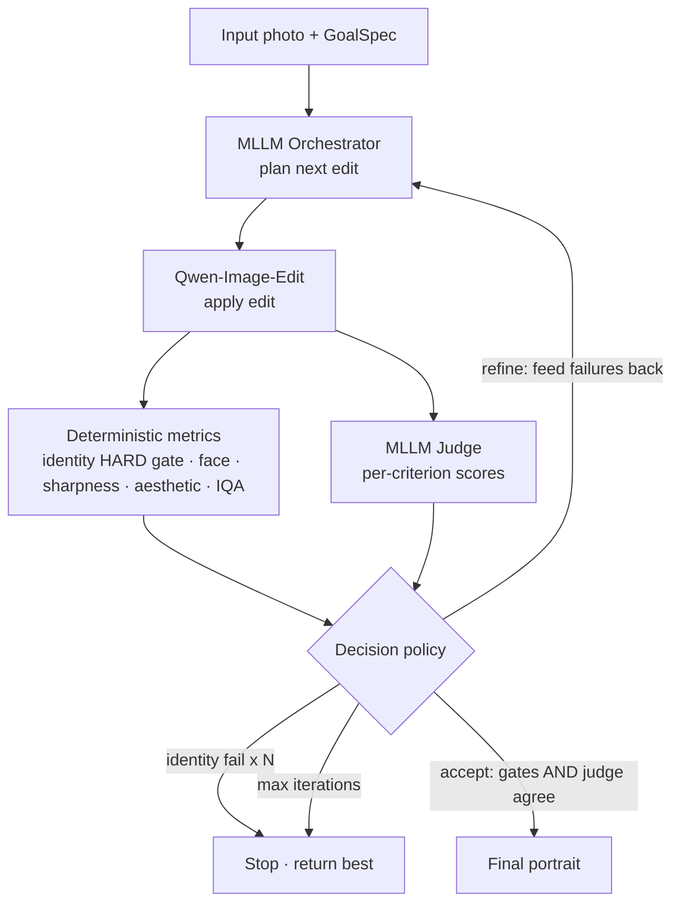
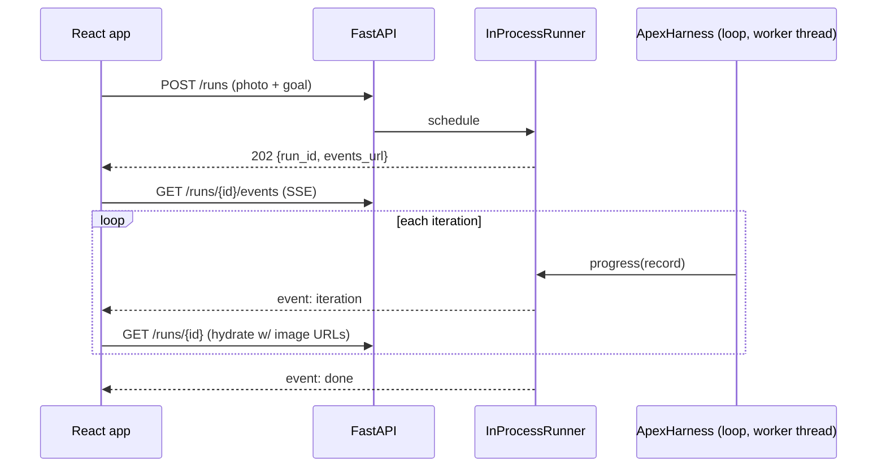

# APEX Architecture

APEX is an **agentic harness** that turns a photo into a professional portrait by
*editing* it, with a quality-assurance loop. One multimodal LLM both **orchestrates**
edits and **judges** results; **deterministic metrics** gate every iteration.

## The loop

Identity is measured against the **original** photo every iteration, so it cannot
drift past the gate one small step at a time. Acceptance requires agreement: the
deterministic gates pass **and** the judge is above threshold **and** marks the
result acceptable. The loop always returns the best iteration, never just the last.

## Layered package (`src/apex/`)

Inner layers never import outer layers; everything depends on the backend
*protocols*, never on torch/vLLM/Replicate directly — which is what makes the
GPU-free `fake` backend (and the whole test suite) possible.

| Layer | Module | Responsibility |
|-------|--------|----------------|
| Domain | `goalspec/` | Typed `GoalSpec` — legacy options, presets, validation, detail dicts, MLLM seed prompts |
| Config | `config/` | Env-driven `Settings`, `QualityThresholds`, `LoopPolicy` |
| Backends | `backends/` | `ChatBackend` + `EditBackend` protocols; `local` (vLLM + Qwen diffusers), `api` (OpenAI-compat + Replicate), `fake` |
| Capabilities | `mllm/`, `editor/`, `metrics/` | Orchestrator + judge; image-edit wrapper; deterministic metrics |
| Orchestration | `loop/` | `IterationRecord`/`RunResult`, a pure decision policy, the engine |
| Persistence | `persistence/` | Profile store, run-state store, per-run image artifacts |
| Service | `service/` | `ApexHarness` (FastAPI-agnostic) + API DTOs |
| API / CLI | `api/`, `cli.py` | FastAPI app, routes, SSE runner; `apex run/serve/doctor` |

## Pluggable backends

`backend_mode = local | api | fake`, with independent `chat_backend` /
`editor_backend` overrides so you can mix (e.g. local Qwen editor + hosted MLLM).

- **Chat (MLLM):** one `OpenAICompatibleChatBackend` for both local vLLM and hosted
  endpoints — base64 image parts + `response_format` json_schema, validated against
  the Pydantic schema with one bounded re-ask.
- **Editor:** `QwenImageEditBackend` (diffusers; full weights or a GGUF-quantized
  transformer), `FluxKontextBackend` (FLUX.1-Kontext-dev fallback, via
  `APEX_EDITOR_ENGINE=flux`), or `ReplicateEditBackend`. Heavy imports are lazy.
- **GPU topology:** the MLLM (vLLM) runs on `cuda:1`; the editor pipeline on
  `cuda:0` (`APEX_EDITOR_DEVICE`).
- **Fake:** canned structured output (judge score ramps) + a deterministic image
  transform — no GPU, no network. Powers tests, CI, and the offline demo.

## Full-stack flow

Long GPU runs execute in a worker thread; progress fans out over SSE. Images are
served as static files (not base64). The React app's TypeScript types are
generated from the FastAPI OpenAPI schema (`npm run gen-types`).

## Quality metrics

| Metric | Kind | Library | Notes |
|--------|------|---------|-------|
| Identity preservation | **hard gate** | InsightFace / ArcFace | cosine vs the original photo; `StubIdentity` for GPU-free runs |
| Face presence | soft gate | OpenCV Haar | exactly one face |
| Sharpness | soft gate | OpenCV Laplacian variance | — |
| Aesthetic | informational | pyiqa (CLIP-IQA) | lazy |
| No-reference IQA | informational | pyiqa (BRISQUE) | lazy |
