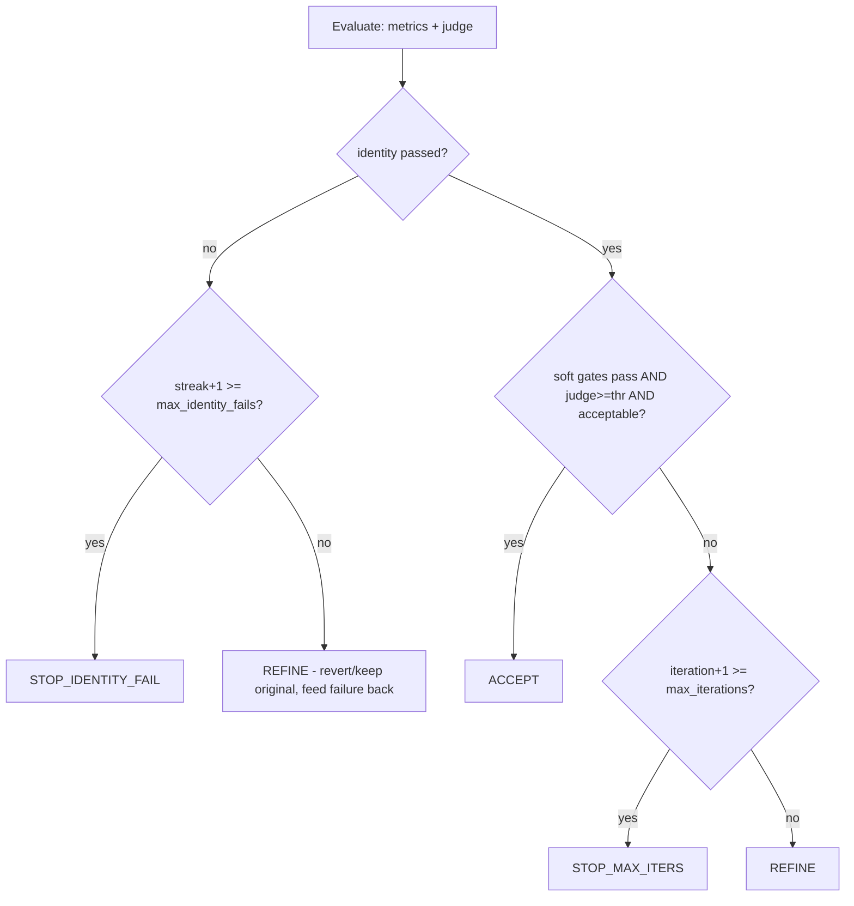

# Metrics & the Loop

APEX's distinguishing idea: quality is gated by **deterministic, model-opinion-free
metrics** *and* the MLLM judge — they must agree to accept. This is what makes
"the portrait is good" a measurable claim rather than a vibe.

## Metrics

Each metric ([`apex.metrics`](../src/apex/metrics/)) implements
`compute(original, candidate) -> MetricResult` with `{value, passed, threshold,
is_gate, is_hard_gate, detail}`. Heavy models load lazily.

| Metric | Kind | Library | Default threshold | Notes |
|--------|------|---------|-------------------|-------|
| **identity** | **hard gate** | InsightFace / ArcFace | `0.35` cosine | Compared against the **original** photo every iteration, so identity can't drift past the gate one small step at a time. A dependency-free `StubIdentity` (structural similarity) backs the `fake` backend / CI. |
| **face** | soft gate | OpenCV Haar | exactly 1 face | Rejects zero or multiple faces. |
| **sharpness** | soft gate | OpenCV Laplacian variance | `100.0` | Cheap blur check. |
| **aesthetic** | informational | pyiqa (CLIP-IQA) | `5.0` | Reported, not gated by default. Needs the `quality` extra. |
| **iqa** | informational | pyiqa (BRISQUE) | `0.0` | No-reference quality. Needs the `quality` extra. |

Selection is via `APEX_ENABLED_METRICS` (default: all available). The verified
GPU setup runs `identity,face,sharpness` (the aesthetic/IQA pair needs the
`quality` extra, which pins an ancient numba).

A `QualityReport` aggregates results and exposes `identity_passed` (the hard
gate), `soft_gates_passed`, and `failures` (human-readable, fed back to the
orchestrator).

## The decision policy

[`apex.loop.policy.decide`](../src/apex/loop/policy.py) is a **pure function**
(no I/O, fully unit-tested). After each iteration:

1. **Hard gate first** — if identity fails:
   - `REFINE` (feed the failure back), or
   - `STOP_IDENTITY_FAIL` once `max_identity_fails` consecutive failures hit.
2. **Accept requires agreement** — all soft gates pass **and** the judge's
   `overall ≥ judge_threshold` **and** the judge marks it `acceptable` → `ACCEPT`.
3. Otherwise `REFINE`, until `max_iterations` → `STOP_MAX_ITERS`.

The run **always returns the best iteration** (a composite score that ranks
identity-passing iterations above failing ones, then by judge score), so a
max-iters or identity-fail stop still yields the best portrait, never the last.

## Edit-from-original

With `APEX_EDIT_FROM_ORIGINAL=true` (default), every iteration edits the
**original** photo — the orchestrator writes one complete, cohesive instruction
incorporating the previous attempt's feedback. This avoids two failure modes of
compounding edits:

- **identity/quality drift** — each pass re-encodes through the VAE, eroding the
  face; editing the original keeps every pass a single clean transform;
- **"pasted on a backdrop" look** — piecemeal "replace the background" edits
  composite the subject onto an unrelated scene. The orchestrator prompt instead
  asks for one shot where the subject is *relit into* the scene.

## Identity restoration interplay

`APEX_IDENTITY_RESTORE=true` grafts the original identity onto each candidate
*before* metrics run, so the identity metric (and judge) score the restored
image. In practice this takes identity from ~0.5 to ~0.9, so you can raise
`APEX_IDENTITY_THRESHOLD` (e.g. to `0.8`) to make the gate enforce a strong
likeness rather than merely rejecting gross failures. See [models.md](models.md#identity-restoration).

## Tuning cheatsheet

| Symptom | Lever |
|---------|-------|
| Face drifts from the person | enable `APEX_IDENTITY_RESTORE`; lower `APEX_EDITOR_GUIDANCE_SCALE` (FLUX); prefer `qwen` |
| "Pasted on background" look | keep `APEX_EDIT_FROM_ORIGINAL=true` (cohesive single-shot instruction) |
| Plastic / waxy skin | the default `APEX_EDITOR_STYLE_SUFFIX` already pushes natural skin; strengthen it |
| Runs never accept (stuck) | `APEX_SHARPNESS_MIN` too high for the editor output, or `APEX_JUDGE_THRESHOLD` too strict — lower them |
| Want a strict identity bar | raise `APEX_IDENTITY_THRESHOLD` (with restoration on) |
| Low-res source caps identity | use a higher-resolution input photo — the single biggest lever |
